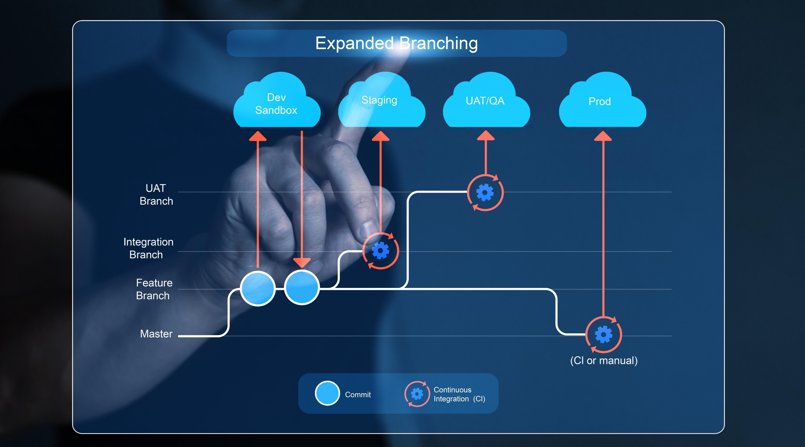

# Feature 功能分支工作流

> **环境**：Git
> **最后更新**：2026-03-30

## 概述

**Feature Branch Workflow（功能分支工作流）** 是目前开发团队中最通用的协作模式。核心思想是：主分支（`main` 或 `master`）始终保持稳定和可部署状态，所有开发都在独立的特性分支上进行。



## 1. 准备阶段：获取与更新

在开始写代码前，确保你拥有仓库并在正确的起跑线上。

- **克隆仓库到本地：**

  ```bash
  git clone <仓库地址>
  ```

- **查看当前配置的远程仓库：**

  ```bash
  git remote -v
  ```

- **拉取远程的最新改动，但不合并：**

  ```bash
  git fetch origin
  ```

  > **注意：** 非常推荐在不确定远程有什么更新时使用，比直接 `pull` 更安全。

## 2. 开发阶段：分支管理

**永远不要在主分支上直接修改代码。** 每次开发新功能或修复 Bug，都应该拉取一个新分支。

- **查看本地和远程的所有分支：**

  ```bash
  git branch -a
  ```

- **基于当前分支，创建并切换到新分支（推荐使用更现代的 `switch`）：**

  ```bash
  git switch -c feature/your-new-feature
  # 或者使用经典的 checkout
  git checkout -b feature/your-new-feature
  ```

- **在已有的分支之间切换：**

  ```bash
  git switch main
  ```

## 3. 提交阶段：保存工作

将你的修改打包成一个逻辑单元。

- **查看当前文件的修改状态：**

  ```bash
  git status
  ```

- **将变动的文件添加到暂存区（Staging Area）：**

  ```bash
  git add <文件名>   # 添加特定文件
  git add .          # 添加当前目录下的所有改动
  ```

- **提交暂存区的内容并附带说明：**

  ```bash
  git commit -m "feat: 新增了用户登录验证逻辑"
  ```

  > **注意：** 建议采用清晰的前缀，如 `feat:` 代表新功能，`fix:` 代表修复，`docs:` 代表文档更新。

## 4. 同步阶段：推送与合并

开发完成后，将分支推送到远程仓库，准备让其他人 Review 或合并。

- **将本地的新分支推送到远程仓库（首次推送）：**

  ```bash
  git push -u origin feature/your-new-feature
  ```

  > **注意：** `-u` 会建立本地分支和远程分支的追踪关系，之后直接敲 `git push` 即可。

- **拉取远程特定分支的更新并合并到当前分支：**

  ```bash
  git pull origin main
  ```

## 5. 救火与实用高级命令

日常开发中难免会遇到"手滑"或需要临时切换任务的情况：

- **临时保存当前未提交的修改（突然需要切换分支修 Bug 时）：**

  ```bash
  git stash
  ```

- **恢复刚才临时保存的修改：**

  ```bash
  git stash pop
  ```

- **撤销上一次 commit，但保留代码（代码退回到暂存区）：**

  ```bash
  git reset --soft HEAD~1
  ```

- **查看带有分支拓扑图的精简提交历史：**

  ```bash
  git log --oneline --graph --all
  ```
